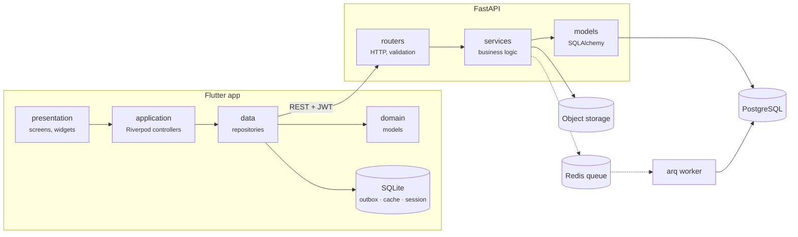
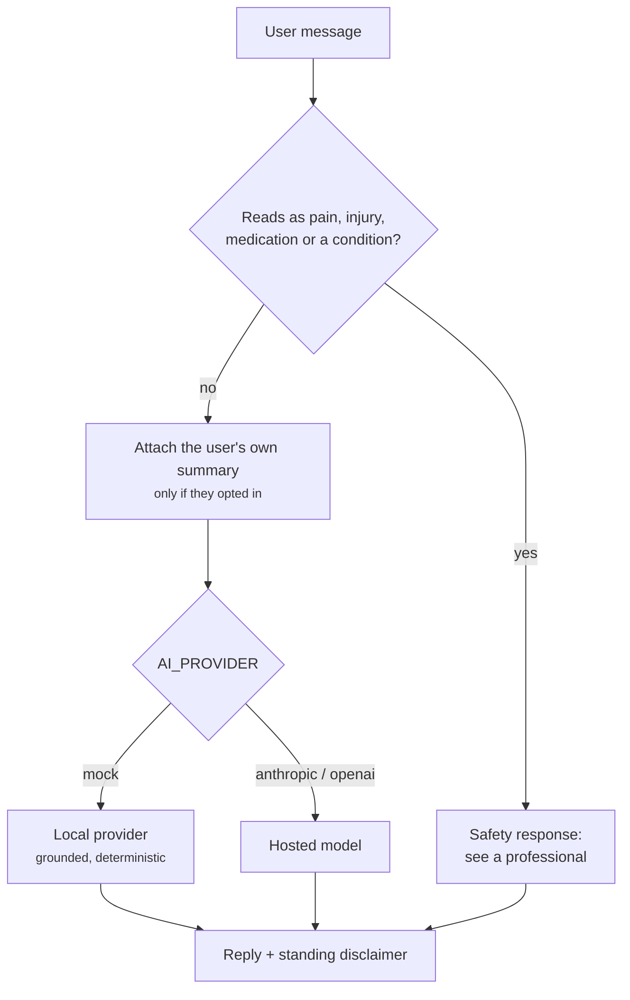
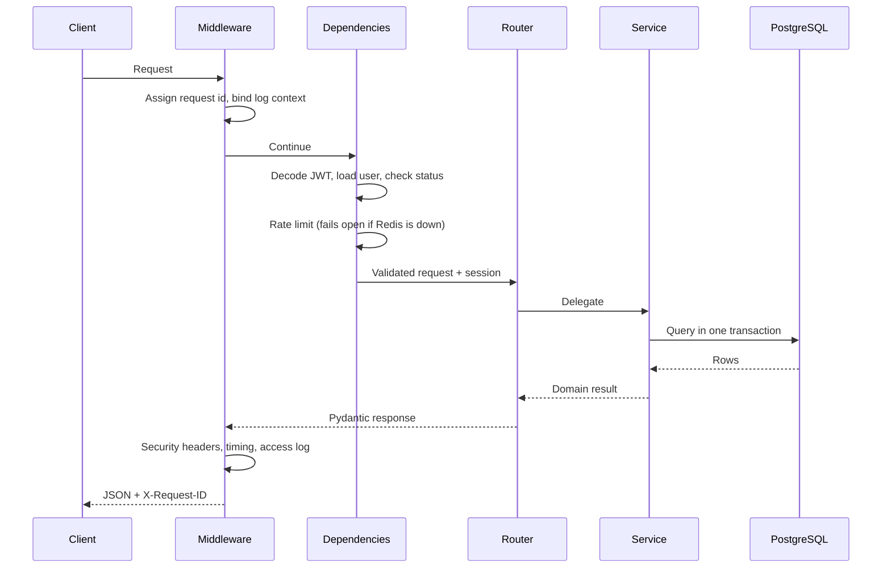

# Architecture

How FitTrack is put together, and why.

---

## Shape of the system

Three deployable pieces and a worker, over PostgreSQL, Redis and object storage.

Each layer only talks to the one below it. A screen never builds a request; a
repository never knows about a widget; a router never contains business logic.

---

## Backend

### Layering

| Layer | Responsibility | Never does |
| --- | --- | --- |
| `api/v1/routers` | HTTP shape, validation, status codes | Query the database |
| `services` | Business rules, transactions, authorisation | Know about `Request` |
| `models` | Tables, relationships, constraints | Contain logic beyond derived properties |
| `schemas` | Request/response contracts | Touch the ORM |

A router reads like the endpoint list: parse, delegate, serialise.

### Portable column types

The suite runs on in-memory SQLite so CI needs no services, while production
runs on PostgreSQL. Two decorators in `app/db/types.py` bridge that:

- `GUID` — native `uuid` on PostgreSQL, 32-char hex elsewhere.
- `JSONDict` — `JSONB` on PostgreSQL, `JSON` elsewhere.

Same Python semantics either way, native types where they matter. This is also
why `created_at`/`updated_at` carry both a Python-side and a server-side
default: SQLite's `CURRENT_TIMESTAMP` only resolves to the second, which would
let a sync delta miss rows written in the same second.

### Idempotency

Anything a client can retry carries a `client_uuid` with a unique constraint
per user: workout sessions, meals, water logs, weigh-ins, measurements, habit
logs. `sync_operations` is a ledger of what has already been applied, so a
replayed batch is answered from the ledger rather than applied twice.

### Denormalised rollups

`workout_sessions` stores `total_volume_kg`, `total_sets` and `total_reps`;
`meals` and `daily_nutrition` store macro totals. History and dashboards read
those columns instead of re-aggregating every set, and they are recomputed
whenever the underlying rows change.

### Personal records

Evaluated per (user, exercise, record type) against the current best. A new
value must beat it by more than a float epsilon, which keeps rounding noise from
producing phantom records. Warm-up sets never count. Re-finishing an edited
workout updates that session's records rather than duplicating them.

### Progression

`app/services/progression.py` is deliberately independent of AI: deterministic,
explainable, and never surprising.

- Two consecutive sessions hitting the top of the rep range on every working set
- and not at RPE 9.5 or above
- → suggest the next increment for that equipment (2.5 kg barbell, 2 kg dumbbell,
  5 kg machine).

Falling short of the rep floor twice suggests a 10% back-off. Nothing is ever
applied automatically.

---

## AI

The safety check runs **before** any provider call, so a message about a torn
hamstring never leaves the server.

Plan generation does not ask a model to invent exercises. `app/ai/planner.py`
selects real movements from the library by muscle group, equipment and
difficulty, applies a goal-appropriate set/rep/rest scheme, and scales the day
to the session length the user chose. A model, when configured, contributes the
coaching notes on top of that structure. A plan is never unusable because an
external API was down.

Saving a generated plan always creates a **new** program. An existing one is
never overwritten.

---

## Mobile

### Why no code generation

Models, JSON and localisation are written by hand. `flutter pub get &&
flutter test` is the whole setup: there is no `build_runner` step that can fall
out of sync with the source, and a contract change surfaces as a compile error
rather than a runtime null.

The same reasoning chose `sqflite` over Drift or Isar. The schema is three
tables and stable; a generated data layer would have bought abstraction the app
doesn't need at the cost of a generation step in every build.

### Offline

Three tables carry the whole story:

| Table | Holds |
| --- | --- |
| `active_session` | The workout in progress, as one document, rewritten on every set |
| `outbox` | Queued mutations with the `client_uuid` the server uses as an idempotency key |
| `cache` | JSON documents keyed by a stable string, so screens render on a cold start offline |

The sync controller drains the outbox when connectivity returns and when the app
resumes. Each operation reports back as `applied`, `duplicate`, `conflict` or
`failed`; the first two retire it, a failure retries with a cap and then parks
for a manual retry rather than blocking the queue forever.

Writes follow one shape everywhere: **update memory, persist, then talk to the
network if it happens to be there.** Nothing in the logging path awaits a
request.

### The rest timer

Driven by a wall-clock deadline, not a tick counter. The periodic timer only
triggers repaints; the remaining time is always `deadline - now`. That's why it
stays correct after the OS freezes the app in the background — on resume the
controller simply recomputes.

### Units

Everything is stored in kilograms and centimetres. Imperial is a conversion at
the edge: the set row converts on entry and on display, and the value that
reaches the database is always metric. A user switching units mid-programme sees
their history reinterpreted, not rewritten.

### Localisation

Standard `.arb` files, the same format `flutter gen-l10n` consumes, loaded at
runtime from the asset bundle. Adding a language is dropping in a file and
listing its locale. Missing keys fall back to English; an unknown key renders as
itself, so a gap looks wrong in the UI rather than crashing the screen.

RTL comes from Flutter's directionality plus directional padding
(`EdgeInsetsDirectional`, `AlignmentDirectional`) throughout — the layout
mirrors properly instead of being flipped wholesale.

---

## Admin dashboard

Next.js App Router with client components for the data-driven pages, TanStack
Query for caching and TypeScript throughout. Tokens live in `sessionStorage`
rather than `localStorage`: it's an operator tool, and that limits the blast
radius of an XSS bug.

Access is checked twice — the API rejects non-admins, and the dashboard refuses
to hold a session for a non-admin account.

Private user content is never exposed. The user detail page shows that someone
has twelve progress photos; there is no path in the product to view one.

---

## Background jobs

| Job | Schedule | Purpose |
| --- | --- | --- |
| `send_workout_reminders` | hourly | Users whose reminder hour has come and who haven't trained |
| `send_habit_reminders` | hourly | Habits still unticked, with the streak at stake |
| `send_weekly_summaries` | Mondays 08:00 | Previous week's training |
| `refresh_goal_progress` | twice daily | Goal progress and missed deadlines |
| `close_stale_sessions` | daily | Workouts left running over 36 hours |
| `cleanup_expired_records` | daily | Expired tokens, revoked sessions, read notifications, old ledger rows |
| `purge_deleted_accounts` | daily | Hard-delete 30 days after deletion, stored objects included |

Reminder jobs run hourly and filter to the users whose configured time falls in
the current hour, rather than scheduling a cron entry per user.

---

## Request lifecycle

Every failure leaves through one of the handlers in `app/core/errors.py`, so the
envelope is identical whether the cause was validation, permissions, a database
constraint or an unhandled exception.
